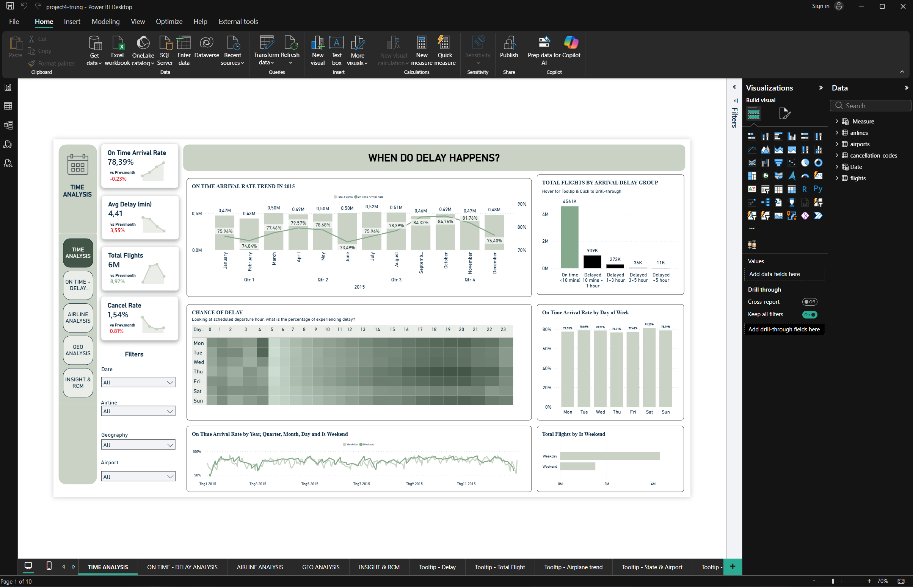

# Power BI Airline Delay & Flight Performance Dashboard

## Project Resources

- 📊 Power BI Dashboard & Dataset File: [Google-Drive]([https://drive.google.com/file/d/19Q251-U3IjZkZD29VNV4UDGubSX35Zx9/view?usp=sharing](https://drive.google.com/drive/folders/1jSTaFQYHCaIPVSdQbv1iN0rWwZjz4xUt?usp=sharing))
---

## Project Overview

This project analyzes airline operations and flight performance using Power BI to identify trends in flight delays, airline efficiency, airport traffic, and geographic performance.

The dashboard enables stakeholders to monitor operational KPIs, evaluate airline performance, analyze delay patterns, and support data-driven decision-making through interactive visual analytics.

---

## Business Objectives

- Monitor overall flight and airline performance
- Analyze on-time vs delayed flight trends
- Identify airports and airlines with high delay frequency
- Evaluate geographic flight distribution
- Track airline operational efficiency over time
- Analyze monthly flight performance trends
- Support aviation performance analysis and operational optimization

---

## Tools & Technologies

- Power BI
- Power Query
- DAX

---

## Data Preparation

The dataset was cleaned and transformed using Power Query before building the data model and visualizations.

Data preparation tasks included:

- Handling missing values
- Formatting date and time fields
- Creating calculated columns
- Building relationships between tables
- Cleaning airport and airline information
- Optimizing the data model for reporting
- Preparing geographic and time-series datasets
- Creating KPI and trend analysis measures

---

## Key KPIs

- **Total Flights**
- **On Time Arrival Rate**
- **On Time Departure Rate**
- **Delay Arrival Rate**
- **Delay Departure Rate**
- **Average Delay Time**
- **Cancelled Flights Rate**
- **Flights per Airline**
- **Flights per Airport**
- **Monthly Flight Growth**
- **Geographic Flight Distribution**

---

## Dashboard Features

- Interactive slicers and filters
- Time-series flight trend analysis
- Airline performance comparison
- On-time vs delay analysis
- Airport and route performance tracking
- Geographic flight analysis
- Monthly performance monitoring
- Dynamic KPI cards and charts
- Drill-through analysis pages
- Interactive tooltip pages
- Cross-filtering visual interactions

---

## Visualization Techniques Used

- KPI Cards
- Line Charts
- Clustered Column Charts
- Clustered Bar Charts
- Pie Charts
- Scatter Charts
- Combo Charts
- Matrix Tables
- Geographic Analysis Visuals
- Time-Series Analysis
- Dynamic Slicers & Filters
- Interactive Tooltips
- Conditional Formatting
- Cross-filtering Visual Interactions
- Page Navigation Buttons

---

## Dashboard Pages

### TIME ANALYSIS
- Flight trends over time
- Monthly delay analysis
- Airline activity monitoring
- Flight volume comparison

### ON TIME - DELAY ANALYSIS
- Delayed vs on-time flight comparison
- Arrival and departure delay tracking
- Airline operational efficiency analysis
- Cancelled flight monitoring

### AIRLINE ANALYSIS
- Airline performance comparison
- Airline delay distribution
- Flight volume analysis
- Operational KPI tracking

### GEO ANALYSIS
- Geographic flight distribution
- Airport performance analysis
- Route-based operational insights
- Regional traffic monitoring

### INSIGHT & RCM
- Key operational insights
- Business recommendations
- Performance summary analysis
- Delay reduction recommendations

---

## Sample DAX Measures

### Total Flights

```DAX
Total Flights =
COUNT(flights[Flight ID])
```

### On Time Arrival Rate

```DAX
On Time Arrival Rate =
CALCULATE(
    COUNT(flights[Flight ID]),
    flights[On time/Delay Arrival] = "On time"
)
/
COUNT(flights[Flight ID])
```

### On Time Departure Rate

```DAX
On Time Departure Rate =
CALCULATE(
    COUNT(flights[Flight ID]),
    flights[On time/Delay Departure] = "On time"
)
/
COUNT(flights[Flight ID])
```

### Avg Delay

```DAX
Avg Delay =
AVERAGE(flights[ARRIVAL_DELAY])
```

### Cancel Rate

```DAX
Cancel Rate =
SUM(flights[CANCELLED])
/
COUNT(flights[Flight ID])
```

### Total Delayed Flights

```DAX
Total Delayed Flights =
CALCULATE(
    COUNT(flights[Flight ID]),
    flights[On time/Delay Arrival] = "Delay"
)
```

### Delay Arrival Rate

```DAX
Delay Arrival Rate =
CALCULATE(
    COUNT(flights[Flight ID]),
    flights[On time/Delay Arrival] = "Delay"
)
/
COUNT(flights[Flight ID])
```

### Delay Departure Rate

```DAX
Delay Departure Rate =
CALCULATE(
    COUNT(flights[Flight ID]),
    flights[On time/Delay Departure] = "Delay"
)
/
COUNT(flights[Flight ID])
```

### % MoM Total Flights

```DAX
% MoM Total Flights =
DIVIDE(
    [Total Flights] - [PM Total Flights],
    [PM Total Flights]
)
```

### % MoM Avg Delay

```DAX
% MoM Avg Delay =
DIVIDE(
    [Avg Delay] - [PM AVG Delay],
    [PM AVG Delay]
)
```

---

## Dashboard Preview



---

## Key Insights

- Certain airlines experienced significantly higher delay rates than competitors
- Peak flight periods showed ***higher operational delay frequency***
- Geographic analysis revealed airports with the highest traffic congestion
- Time-series analysis identified seasonal delay patterns
- Cancelled flights negatively impacted airline operational efficiency
- Route performance analysis highlighted inefficient flight operations
- Interactive dashboards improved airline and airport performance monitoring

---

## Skills Demonstrated

- Data Cleaning & Transformation
- Data Modeling
- DAX Calculations
- Time-Series Analysis
- Business Analytics
- Data Visualization
- Dashboard Design
- KPI Reporting
- Interactive Dashboard Development

---
